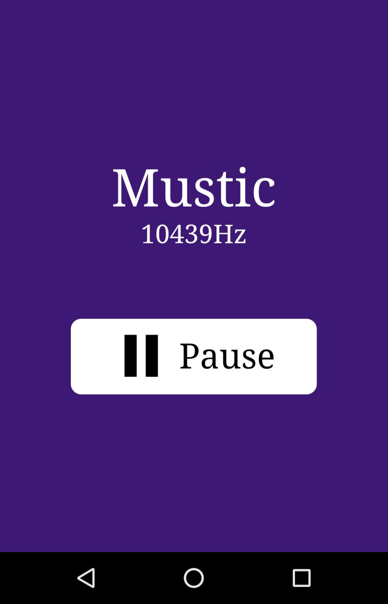

# mustic
> 📱🎶 Device as music stick

**Mustic** is an Experimental app which takes input from the *Device Orientation API* and gives to *Web Audio API*. Basically what it does is listening to the orientation change, combines the (alpha, beta, gamma) value to produce frequency for the audio output.




## Getting started
### Setting up Dev

Install local dependencies from project's root folder:
```
yarn
```
`gulp` & `simplehttpserver` are required as global npm dependencies.

### Building
```
npm run dev
```
This will trigger gulp tasks for build & start watch for changes

### Running
```
npm start
```
This will start the server up and running at [http://localhost:8000](http://localhost:8000)

## Demo
> ### ⚠️ Warning
> This app's generated sound is not optimized. **The sound is really creepy** which might affect your ear/brain, please be aware!! ..and keep mobile volume down if you are testing.

#### [Demo in now.sh](https://mustic-pnfduhxyvi.now.sh/) - works only in mobile devices